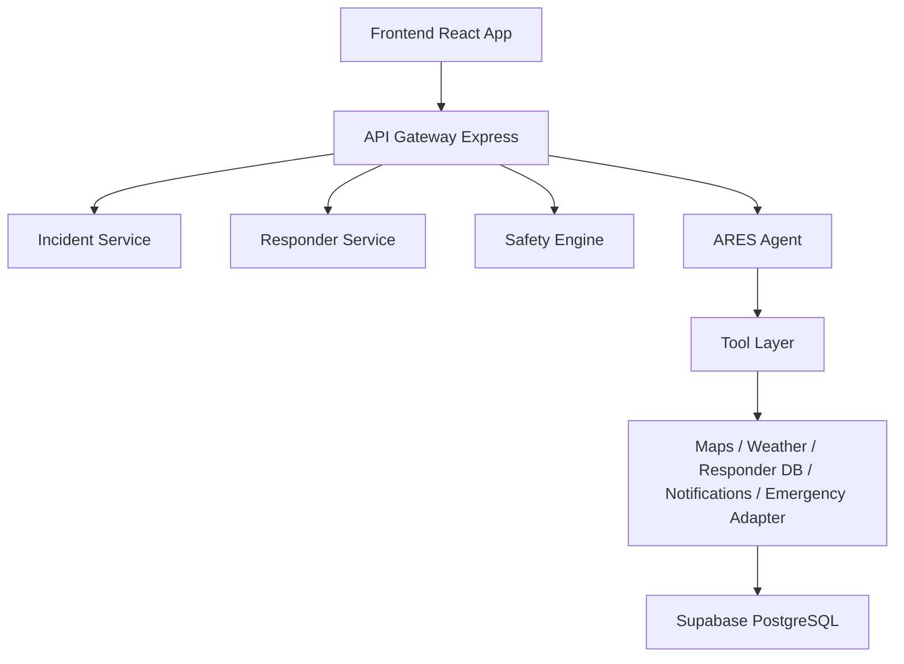

# RESQNET Architecture

## System Flow

## Decision Boundaries

### AI-assisted decisions

- responder ranking explanation
- incident summarization
- operational recommendations
- workflow orchestration
- dispatch wave planning

### Deterministic safety rules

- emergency-service priority
- volunteer dispatch blocking in high-risk scenes
- training validation enforcement
- availability checks
- unsafe route blocking
- hard eligibility filtering
- human override gating

## Components

### Frontend

The frontend provides the command center, incident reporting, responder dashboard, and landing experience. It consumes backend APIs and focuses on operational clarity, accessibility, and real-time status flows.

### API Gateway

Express routes expose REST endpoints for incidents, responders, routing, weather, analytics, agent orchestration, and demo scenario execution.

### Incident Service

The incident service manages report creation, verification, lifecycle states, dispatch actions, and response history.

### Safety Engine

The backend safety engine is the definitive source of enforcement for responder and dispatch gate logic. It determines whether a high-risk scene permits volunteer dispatch and evaluates responder suitability based on weighted scores and hard restrictions.

### ARES Agent

ARES orchestrates tool-calling workflows, evaluates incident context, and produces explainable operational outputs. It must never override deterministic safety gates and must defer to human review when required.

### Supporting services

- Mapbox-compatible routing service with mock fallback
- Open-Meteo weather service with mock fallback
- Notification provider abstraction
- Mock emergency-service simulation adapter
- Audit log and analytics service

## Production Notes

The system is designed to run in mock mode by default for hackathon/demo readiness. Actual integrations can be enabled by supplying service credentials and switching providers in environment variables.
